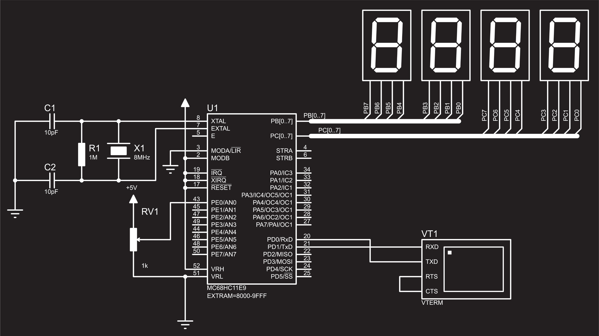

### 代码 1：`09_19_01.c` (库函数流水灯)

#### 1. 代码实现效果 (What it does)

主程序：P2 口连接的 8 个 LED 灯，从高位（D7）向低位（D0）依次点亮，并循环滚动（跑马灯效果）。

#### 2. 实现思路 (How it works)

- **库函数移位：** 使用 `<intrins.h>` 库中的 `_cror_(a, 1)` 函数实现循环右移。
- **循环特性：** 与普通 `>>` 移位不同，`_cror_` 会将移出的最低位补回到最高位，保证数据不会丢失，实现真正的“循环”。
- **延时控制：** 使用 `delay` 函数控制流水灯流动的速度。

#### 3. 硬件连接 (Hardware Wiring)

- **P2口接发光二极管**
- **连接方式：** 根据代码 `a=0x80` (1000 0000) 且 `P2=a`，高电平点亮
  - *注：标准 51 实验板通常为低电平点亮，但此代码逻辑倾向于高电平逻辑，或意在控制“亮点”流动。*

#### 4. 代码注释补充 (Comment Enhancement)

```c
// ======= 含注释版本 =======
#include<reg52.h>
#include<intrins.h> // 包含循环移位函数 _cror_ 的头文件

unsigned int a;

// 延时函数
void delay(unsigned int z,unsigned int w)
{
    unsigned int x,y;
    for(x=0;x<z;x++)
        for(y=0;y<w;y++);
}

void main()
{
    a = 0x80; // 初始化：1000 0000，最高位点亮
    while(1)
    {
        P2 = a;             // 将数据输出到 P2 口驱动 LED
        delay(1000, 40/4);  // 延时约 0.5/4 = 0.125秒 (基于说明文档)
        a = _cror_(a, 1);   // 循环右移 1 位 (10000000 -> 01000000)
    }
}
```

#### 5. 排版优化后的最终代码 (Formatted Code)

```c
#include <reg52.h>
#include <intrins.h>

unsigned int a;

void delay(unsigned int z, unsigned int w)
{
    unsigned int x, y;
    for (x = 0; x < z; x++)
        for (y = 0; y < w; y++);
}

void main()
{
    a = 0x80;
    while (1)
    {
        P2 = a;
        delay(1000, 40 / 4);
        a = _cror_(a, 1);
    }
}
```

------

### 代码 2：`09_19_02.c` (普通移位流水灯)

#### 1. 代码实现效果 (What it does)

主程序：LED 灯从左向右（D7 到 D0）依次点亮。

当移动到最后一位（D0）后，立刻复位回到 D7 重新开始（非循环衔接，是复位衔接）。

#### 2. 实现思路 (How it works)

- **位运算移位：** 使用 C 语言标准右移运算符 `>>`。
- **For 循环控制：** 也就是通常说的“数组法”或“移位法”的基础，通过 `i<8` 限制移动次数。
- **数据丢失特性：** 普通 `>>` 移位后，高位补 0。移位 8 次后 `a` 变为 0，所以必须在 `while(1)` 内部重新赋值 `a=0x80`。

#### 3. 硬件连接 (Hardware Wiring)

- **P2口接发光二极管**

#### 4. 代码注释补充 (Comment Enhancement)

```c
// ======= 含注释版本 =======
#include<reg52.h>

unsigned int a, i;

void delay(unsigned int z, unsigned int w)
{
    unsigned int x, y;
    for(x=0; x<z; x++)
        for(y=0; y<w; y++);
}

void main()
{
    while(1)
    {
        a = 0x80; // 每次循环开始重置为 1000 0000
        for(i=0; i<8; i++) // 循环 8 次，对应 8 个 LED
        {
            P2 = a;             // 输出显示
            delay(1000, 40/4);  // 延时
            a = a >> 1;         // 右移一位，高位补0
        }
    }
}
```

#### 5. 排版优化后的最终代码 (Formatted Code)

```c
#include <reg52.h>

unsigned int a, i;

void delay(unsigned int z, unsigned int w)
{
    unsigned int x, y;
    for (x = 0; x < z; x++)
        for (y = 0; y < w; y++);
}

void main()
{
    while (1)
    {
        a = 0x80;
        for (i = 0; i < 8; i++)
        {
            P2 = a;
            delay(1000, 40 / 4);
            a = a >> 1;
        }
    }
}
```

------

### 代码 3：`09_19_03.c` (数组法走马灯)

#### 1. 代码实现效果 (What it does)

主程序：P2 口的 LED 实现左移流水灯效果（类似进度条加载）。

$$
效果序列：亮1个 \rightarrow 亮2个 \rightarrow 亮3个 ... \rightarrow 全亮 \rightarrow 循环。
$$

#### 2. 实现思路 (How it works)

- **查表法 (Look-up Table)：** 使用 `code` 关键字定义数组 `zyzmd[]`，将预设好的花样数据存储在 ROM 中。
- **二进制规律：** 数组内容 `0x01` (00000001), `0x03` (00000011), `0x07` (00000111) 等，体现了逐个叠加点亮的逻辑。

#### 3. 硬件连接 (Hardware Wiring)

- **P2口接发光二极管**

#### 4. 代码注释补充 (Comment Enhancement)

```c
// ======= 含注释版本 =======
#include<reg52.h>

unsigned int i;
// 定义走马灯数组，存放在 code 区（程序存储器）节省 RAM
// 0x01(0000 0001), 0x03(0000 0011)... 0xff(1111 1111)
unsigned int code zyzmd[] = {0x01, 0x03, 0x07, 0x0f, 0x1f, 0x3f, 0x7f, 0xff};

void delay(unsigned int z, unsigned int w)
{
    unsigned int x, y;
    for(x=0; x<z; x++)
        for(y=0; y<w; y++);
}

void main()
{
    while(1)
    {
        for(i=0; i<8; i++) // 遍历数组中的 8 个状态
        {
            P2 = zyzmd[i];      // 取出数组第 i 个元素赋给 P2
            delay(1000, 40/4);  // 延时
        }
    }
}
```

#### 5. 排版优化后的最终代码 (Formatted Code)

```c
#include <reg52.h>

unsigned int i;
unsigned int code zyzmd[] = {0x01, 0x03, 0x07, 0x0f, 0x1f, 0x3f, 0x7f, 0xff};

void delay(unsigned int z, unsigned int w)
{
    unsigned int x, y;
    for (x = 0; x < z; x++)
        for (y = 0; y < w; y++);
}

void main()
{
    while (1)
    {
        for (i = 0; i < 8; i++)
        {
            P2 = zyzmd[i];
            delay(1000, 40 / 4);
        }
    }
}
```

------

### 代码 4：`09_28_01.c` (数码管段码测试/双向显示)

#### 1. 代码实现效果 (What it does)

主程序：小数码管显示0~9，大数码管显示对应小数码管+1的数字。

P1 口（小数码管）：依次显示数码管段码 0 到 9。

P2 口（大数码管）：显示小数码管+1的数字

#### 2. 实现思路 (How it works)

- **共阳/共阴数码管逻辑：** `duanma` 数组 (`0x3f, 0x06...`) 是典型的 **共阴极数码管** 字形码（1 为亮）。

- **双端口控制：** 

  `P1=duanma[i]`。

  `P2` 输出 `~duanma[i]`

#### 3. 硬件连接 (Hardware Wiring)

- **P1 口** \rightarrow **共阴极数码管段选** (a-dp)。
- **P2 口** \rightarrow **共阳极数码管段选** 或 **LED 阵列** (用于显示反相图案)。
- **P3 口** \rightarrow `0xf8` (11111000)，可能连接了位选线（3-8译码器输入）或控制线，选中特定的数码管位置。

#### 4. 代码注释补充 (Comment Enhancement)

C

```c
// ======= 含注释版本 =======
#include<reg52.h>
#include"delay.h" // 引用外部延时头文件

#define uint unsigned int

// 共阴极数码管段码表：0~9, 最后一个 0x00 是熄灭
uint code duanma[] = {0x3f, 0x06, 0x5b, 0x4f, 0x66, 0x6d, 0x7d, 0x07, 0x7f, 0x6f, 0x00};
uint i;

void main()
{
    while(1)
    {
        P3 = 0xf8; // 端口初始化，可能是位选或控制信号 (1111 1000)
        
        for(i=0; i<10; i++) // 循环显示 0-9
        {
            P1 = duanma[i];      // 小数码管显示i
            P2 = ~duanma[i+1];   // 大数码管显示i+1
            delay(1000, 40*4);   
        }
    }
}
```

#### 5. 排版优化后的最终代码 (Formatted Code)

```c
#include <reg52.h>
#include "delay.h"

#define uint unsigned int

uint code duanma[] = {0x3f, 0x06, 0x5b, 0x4f, 0x66, 0x6d, 0x7d, 0x07, 0x7f, 0x6f, 0x00};
uint i;

void main()
{
    while (1)
    {
        P3 = 0xf8;
        for (i = 0; i < 10; i++)
        {
            P1 = duanma[i];
            P2 = ~duanma[i + 1];
            delay(1000, 40 * 4);
        }
    }
}
```

**数码管动态扫描（Dynamic Display）**

本批次包含 4 个代码：`09_28_02.c` 至 `09_30_01.c`。

------

### 代码 5：`09_28_02.c` (数码管逐位测试)

#### 1. 代码实现效果 (What it does)

在一个管子上循环显示0-7后转移到下一个管子继续显示，每个字符0.125秒 

第 1 个数码管先依次显示 0~7；

结束后，第 2 个数码管依次显示 0~7；

以此类推，直到第 8 个数码管显示完 0~7，然后循环。

#### 2. 实现思路 (How it works)

- **嵌套循环：**
  - 外层循环 `j` 控制 **位选**（哪一个数码管亮）。
  - 内层循环 `i` 控制 **段选**（显示什么数字）。

#### 3. 硬件连接 (Hardware Wiring)

- **P1 口** 接 **数码管**
- **P2 口**低三位 接 **译码器**

#### 4. 代码注释补充 (Comment Enhancement)

```c
// ======= 含注释版本 =======
#include<reg52.h>
#include"delay.h"
#define uint unsigned int

// 段码表：共阴极 0~7
uint code duanma[]={0x3f,0x06,0x5b,0x4f,0x66,0x6d,0x7d,0x07};
// 位选表：对应 3-8 译码器的输入 000~111，分别选中第1~8个数码管
uint code weixuan[]={0x00,0x01,0x02,0x03,0x04,0x05,0x06,0x07};
uint i,j;

void main()
{
    while(1)
    {
        for(j=0;j<8;j++) // 外循环：切换数码管位置 (第1个 -> 第8个)
        {
            P2=weixuan[j]; // 输出位选信号
            for(i=0;i<8;i++) // 内循环：在当前位置依次显示数字
            {
                P1=duanma[i];      // 输出段码
                delay(1000,40/4);  // 延时约 0.125s
            }
        }
    }
}
```

#### 5. 排版优化后的最终代码 (Formatted Code)

C

```c
#include <reg52.h>
#include "delay.h"
#define uint unsigned int

uint code duanma[] = {0x3f, 0x06, 0x5b, 0x4f, 0x66, 0x6d, 0x7d, 0x07};
uint code weixuan[] = {0x00, 0x01, 0x02, 0x03, 0x04, 0x05, 0x06, 0x07};
uint i, j;

void main()
{
    while (1)
    {
        for (j = 0; j < 8; j++)
        {
            P2 = weixuan[j];
            for (i = 0; i < 8; i++)
            {
                P1 = duanma[i];
                delay(1000, 40 / 4);
            }
        }
    }
}
```

------

### 代码 6：`09_28_03.c` (标准动态扫描)

#### 1. 代码实现效果 (What it does)

走马数码，在8个数码管上依次显示0-7，每个字符0.25秒

8 个数码管同时显示（视觉上）：

第 1 位显示 0，第 2 位显示 1 ... 第 8 位显示 7。

屏幕显示内容为：“0 1 2 3 4 5 6 7”。

#### 2. 实现思路 (How it works)

- **视觉暂留（Persistence of Vision）：** 利用人眼特性。每个数码管实际上是轮流点亮的，但因为切换速度极快（毫秒级），看起来所有灯都常亮。

- **消影（Blanking）：** `P1=0x00`。在切换下一位之前，必须先把段选清零。否则，上一个数字的余辉会出现在下一个位置，导致显示重影（鬼影）。

- **扫描流程：**
  $$
  选位 \rightarrow 送段码 \rightarrow 微延时 \rightarrow 消影 \rightarrow 下一位。
  $$
  

#### 3. 硬件连接 (Hardware Wiring)

- **P1 口** 接 **数码管**
- **P2 口低三位**接**译码器**

#### 4. 代码注释补充 (Comment Enhancement)

```c
// ======= 含注释版本 =======
#include<reg52.h>
#include"delay.h"
#define uint unsigned int

uint code duanma[]={0x3f,0x06,0x5b,0x4f,0x66,0x6d,0x7d,0x07};
uint code weixuan[]={0x00,0x01,0x02,0x03,0x04,0x05,0x06,0x07};
uint i;

void main()
{
    while(1)
    {
        for(i=0;i<8;i++) // 快速轮询 8 个位置
        {
            P2=weixuan[i]; // 1. 位选：选中第 i 个数码管
            P1=duanma[i];  // 2. 段选：显示数字 i
            
            // 3. 扫描延时：必须非常短！
            // 这里 delay(10, 4) 极短，保证不闪烁
            delay(1000/100, 40/10); 
            // 问：delay的时间短了，每个数字周围部分有点亮（视觉暂留）。如何解决？
            // 答：消影。添加一句p1=0x00;
            P1=0x00; // 4. 消影
        }
    }
}
```

#### 5. 排版优化后的最终代码 (Formatted Code)

```c
#include <reg52.h>
#include "delay.h"
#define uint unsigned int

uint code duanma[] = {0x3f, 0x06, 0x5b, 0x4f, 0x66, 0x6d, 0x7d, 0x07};
uint code weixuan[] = {0x00, 0x01, 0x02, 0x03, 0x04, 0x05, 0x06, 0x07};
uint i;

void main()
{
    while (1)
    {
        for (i = 0; i < 8; i++)
        {
            P2 = weixuan[i];
            P1 = duanma[i];
            delay(1000 / 100, 40 / 10);
            P1 = 0x00;
        }
    }
}
```

------

### 代码 7：`09_28_04.c` (多页动态显示)

#### 1. 代码实现效果 (What it does)

8 个数码管进行翻页显示：在8个数码管上动态显示0-7，使得肉眼看起来8个数字一起显示

第 1 页：显示数组中第 0-7 个数据。

停留约 1 秒后 \rightarrow 切换第 2 页：显示第 8-15 个数据。

停留约 1 秒后 \rightarrow 切换第 3 页... 依次循环显示 4 页内容。

#### 2. 实现思路 (How it works)

- **三层循环结构：**
  - 外层 `j` (0-3)：控制“页码”，共 4 组数据。
  - 中层 `k` (0-1000)：控制“显示时长”。因为动态扫描需要在极短时间内完成一次，为了让用户看清内容，必须重复扫描很多次（即重复刷新画面）。
  - 内层 `i` (0-7)：执行单次“动态扫描”，刷新 8 个数码管。
- **数据索引：** `P0=duanma[i + 8*j]`。
  - 当 j=0，取 duanma[0]~[7]。
  - 当 j=1，取 duanma[8]~[15]。

#### 3. 硬件连接 (Hardware Wiring)

- **P0 口** \rightarrow **数码管段选** (注意这里变成了 P0，通常 P0 需要上拉电阻)。
- **P2 口** \rightarrow **数码管位选**。

#### 4. 代码注释补充 (Comment Enhancement)

```
// ======= 含注释版本 =======
#include <reg52.h>
#include "delay.h"
#define uint unsigned int

// 包含 32 个数据的长数组，分 4 页显示
uint code duanma[]={
    0x5b,0x3f,0x5b,0x66, 0x77,0x7c,0x39,0x5e, // 第1页数据
    0x3f,0x3f,0x3f,0x3f, 0x3f,0x3f,0x3f,0x3f, // 第2页数据
    0x06,0x06,0x06,0x06, 0x06,0x06,0x06,0x06, // 第3页数据
    0x4f,0x4f,0x4f,0x4f, 0x4f,0x4f,0x4f,0x4f  // 第4页数据
};  
uint code weixuan[]={0x00,0x01,0x02,0x03,0x04,0x05,0x06,0x07};
uint i,j,k;

void main()
{
    while(1)
    { 
        for(j=0;j<4;j++) // 页码循环：共4页
        {
            // 显示保持循环：执行1000次扫描，产生视觉停留时间
            for(k=0;k<1000;k++) 
            {
                for(i=0;i<8;i++) // 单帧扫描循环
                {
                    P2=weixuan[i];           // 位选
                    P0=duanma[i+8*j];        // 段选：基地址(8*j) + 偏移(i)
                    delay(1000/1000,40);     // 短延时
                    P0=0x00;                 // 消影
                }
            }
        }
    }
}
```

#### 5. 排版优化后的最终代码 (Formatted Code)

C

```
#include <reg52.h>
#include "delay.h"
#define uint unsigned int

uint code duanma[] = {
    0x5b, 0x3f, 0x5b, 0x66, 0x77, 0x7c, 0x39, 0x5e,
    0x3f, 0x3f, 0x3f, 0x3f, 0x3f, 0x3f, 0x3f, 0x3f,
    0x06, 0x06, 0x06, 0x06, 0x06, 0x06, 0x06, 0x06,
    0x4f, 0x4f, 0x4f, 0x4f, 0x4f, 0x4f, 0x4f, 0x4f};
uint code weixuan[] = {0x00, 0x01, 0x02, 0x03, 0x04, 0x05, 0x06, 0x07};
uint i, j, k;

void main()
{
    while (1)
    {
        for (j = 0; j < 4; j++)
        {
            for (k = 0; k < 1000; k++)
            {
                for (i = 0; i < 8; i++)
                {
                    P2 = weixuan[i];
                    P0 = duanma[i + 8 * j];
                    delay(1000 / 1000, 40);
                    P0 = 0x00;
                }
            }
        }
    }
}
```

------

### 代码 8：`09_30_01.c` (指定内容的动态扫描)

#### 1. 代码实现效果 (What it does)

8 个数码管同时显示特定的一串数字/字符。

显示内容为：2 0 2 5 0 9 3 0 (根据段码 5b, 3f, 5b, 6d, 3f, 6f, 4f, 3f 推算)。

注：推测这是显示日期“20250930”。

#### 2. 实现思路 (How it works)

- **原理：** 同代码 6（标准动态扫描）。
- **区别：** 代码 6 是显示 `0-7`，这里显示的是 `duanma` 数组里自定义好的 8 个特定数字。

#### 3. 硬件连接 (Hardware Wiring)

- **P0 口** \rightarrow **数码管段选**。
- **P2 口** \rightarrow **数码管位选** (3-8 译码器)。

#### 4. 代码注释补充 (Comment Enhancement)

C

```
// ======= 含注释版本 =======
#include<reg52.h>
#include"delay.h"
#define uint unsigned int

// 自定义显示的数字序列
// 0x5b(2), 0x3f(0), 0x5b(2), 0x6d(5), 0x3f(0), 0x6f(9), 0x4f(3), 0x3f(0)
uint code duanma[]={0x5b,0x3f,0x5b,0x6d,0x3f,0x6f,0x4f,0x3f};
uint code weixuan[]={0x00,0x01,0x02,0x03,0x04,0x05,0x06,0x07};
uint i;

void main()
{
    while(1)
    {
        for(i=0;i<8;i++) // 循环扫描
        {
            P2=weixuan[i];         // 选位
            P0=duanma[i];          // 送段
            delay(1000/100,40/10); // 短延时 (扫描速度)
            P0=0x00;               // 消影
        }
    }
}
```

#### 5. 排版优化后的最终代码 (Formatted Code)

C

```
#include <reg52.h>
#include "delay.h"
#define uint unsigned int

uint code duanma[] = {0x5b, 0x3f, 0x5b, 0x6d, 0x3f, 0x6f, 0x4f, 0x3f};
uint code weixuan[] = {0x00, 0x01, 0x02, 0x03, 0x04, 0x05, 0x06, 0x07};
uint i;

void main()
{
    while (1)
    {
        for (i = 0; i < 8; i++)
        {
            P2 = weixuan[i];
            P0 = duanma[i];
            delay(1000 / 100, 40 / 10);
            P0 = 0x00;
        }
    }
}
```

------

本批次涵盖了 **蜂鸣器频率控制**、**独立按键检测** 以及 **LCD1602 液晶显示** 的基础应用。

------

### 代码 9：`10_10_03.c` (蜂鸣器节奏控制)

#### 1. 代码实现效果 (What it does)

蜂鸣器发出有节奏的声音序列：

1. **长鸣**（响约 1200 个周期） \rightarrow 静音。

2. **长鸣**（响约 1200 个周期） \rightarrow 静音。

3. 短鸣（响约 400 个周期） \rightarrow 静音。

   循环播放类似“嘀—— 嘀—— 滴”的节奏。

#### 2. 实现思路 (How it works)

- **音频产生原理：** 蜂鸣器需要脉冲信号驱动。通过 `fmq = ~fmq` 不断取反高低电平，产生震动波。
- **频率控制：** `delay` 的时间决定音调高低（频率）。此处延时固定，音调不变。
- **时长控制：** `for` 循环的次数（`i<1200` 或 `i<400`）决定声音持续的时间长度。

#### 3. 硬件连接 (Hardware Wiring)

- **P1.0** \rightarrow **蜂鸣器** (Active Low/High driver，通常通过三极管驱动)。

#### 4. 代码注释补充 (Comment Enhancement)

C

```
// ======= 含注释版本 =======
#include <reg52.h>
#include "delay.h"
#define uint unsigned int

sbit fmq = P1^0; // 定义蜂鸣器端口
uint i;

void main()
{
    while(1)
    {
        // 第一阶段：长鸣
        for(i=0; i<1200; i++)
        {
            fmq = ~fmq; // 产生方波
            delay(1000/1000, 42/2); // 延时决定频率 (音调)
        }
        
        // 间歇
        fmq = 1; // 关闭蜂鸣器 (假设低电平触发，这里置高为灭)
        delay(1000, 42); // 静音约 0.5 秒

        // 第二阶段：长鸣 (同上)
        for(i=0; i<1200; i++)
        {
            fmq = ~fmq;
            delay(1000/1000, 42/2);
        }
        
        // 间歇
        fmq = 1;
        delay(1000, 42);

        // 第三阶段：短鸣 (次数除以3，时长变短)
        for(i=0; i<1200/3; i++)
        {
            fmq = ~fmq;
            delay(1000/1000, 42/2);
        }
        
        // 间歇
        fmq = 1;
        delay(1000, 42);
    }
}
```

#### 5. 排版优化后的最终代码 (Formatted Code)

C

```
#include <reg52.h>
#include "delay.h"
#define uint unsigned int

sbit fmq = P1 ^ 0;
uint i;

void main()
{
    while (1)
    {
        // 声音段 1
        for (i = 0; i < 1200; i++)
        {
            fmq = ~fmq;
            delay(1000 / 1000, 42 / 2);
        }
        fmq = 1;
        delay(1000, 42);

        // 声音段 2
        for (i = 0; i < 1200; i++)
        {
            fmq = ~fmq;
            delay(1000 / 1000, 42 / 2);
        }
        fmq = 1;
        delay(1000, 42);

        // 声音段 3
        for (i = 0; i < 1200 / 3; i++)
        {
            fmq = ~fmq;
            delay(1000 / 1000, 42 / 2);
        }
        fmq = 1;
        delay(1000, 42);
    }
}
```

------

### 代码 10：`10_14_02.c` (独立按键点亮数码管)

#### 1. 代码实现效果 (What it does)

8 个独立按键对应控制 8 个数码管位：

按下 K0 \rightarrow 第 0 位数码管显示 '0'。

按下 K1 \rightarrow 第 1 位数码管显示 '1'。

...

按下 K7 \rightarrow 第 7 位数码管显示 '7'。

松开按键后，显示保持还是消失取决于代码逻辑（此代码中 while(!k0) 会卡死在显示状态，松手后退出 if，下一轮循环 P0=0x00 会熄灭显示，除非一直按着）。

#### 2. 实现思路 (How it works)

- **按键消抖：** 检测到 `P1!=0xff`（有键按下）后，延时约 20ms，再次检测确认，排除抖动干扰。
- **位判断：** 依次判断 `k0` 到 `k7` 哪个为低电平（0）。
- **显示逻辑：** 设置对应的位选 (`P2`) 和段选 (`P0`)。
- **松手检测：** `while(!k0);` 是一种阻塞写法，按住按键时 CPU 会一直停在这里维持显示，松手后才继续执行。

#### 3. 硬件连接 (Hardware Wiring)

- **P1 口** \rightarrow **8 个独立按键** (K0~K7 接地)。
- **P0 口** \rightarrow **数码管段选**。
- **P2 口** \rightarrow **数码管位选** (3-8 译码器)。

#### 4. 代码注释补充 (Comment Enhancement)

C

```
// ======= 含注释版本 =======
#include<reg52.h>
#include"delay.h"
#define uint unsigned int

// 定义按键端口
sbit k0=P1^0; sbit k1=P1^1;
sbit k2=P1^2; sbit k3=P1^3;
sbit k4=P1^4; sbit k5=P1^5;
sbit k6=P1^6; sbit k7=P1^7;

void main()
{
    P0=0x00; // 初始化灭灯
    while(1)
    {
        // 1. 粗检测：是否有任意按键按下
        if(P1!=0xff) 
            delay(1000/50,40); // 消抖延时 20ms

        // 2. 细检测：确认真的有键按下
        if(P1!=0xff)
        {
            // 3. 判断具体是哪个键，并显示对应数字
            if(k0==0) { P2=0x00; P0=0x3f; while(!k0); } // 按住K0显示0，直到松手
            if(k1==0) { P2=0x01; P0=0x06; while(!k1); } // 按住K1显示1
            if(k2==0) { P2=0x02; P0=0x5b; while(!k2); }
            if(k3==0) { P2=0x03; P0=0x4f; while(!k3); }
            if(k4==0) { P2=0x04; P0=0x66; while(!k4); }
            if(k5==0) { P2=0x05; P0=0x6d; while(!k5); }
            if(k6==0) { P2=0x06; P0=0x7d; while(!k6); }
            if(k7==0) { P2=0x07; P0=0x07; while(!k7); }
        }
        
        P0=0x00; // 松手后熄灭
    }
}
```

#### 5. 排版优化后的最终代码 (Formatted Code)

C

```
#include <reg52.h>
#include "delay.h"
#define uint unsigned int

sbit k0 = P1 ^ 0; sbit k1 = P1 ^ 1;
sbit k2 = P1 ^ 2; sbit k3 = P1 ^ 3;
sbit k4 = P1 ^ 4; sbit k5 = P1 ^ 5;
sbit k6 = P1 ^ 6; sbit k7 = P1 ^ 7;

void main()
{
    P0 = 0x00;
    while (1)
    {
        if (P1 != 0xff)
            delay(1000 / 50, 40);

        if (P1 != 0xff)
        {
            if (k0 == 0) { P2 = 0x00; P0 = 0x3f; while (!k0); }
            if (k1 == 0) { P2 = 0x01; P0 = 0x06; while (!k1); }
            if (k2 == 0) { P2 = 0x02; P0 = 0x5b; while (!k2); }
            if (k3 == 0) { P2 = 0x03; P0 = 0x4f; while (!k3); }
            if (k4 == 0) { P2 = 0x04; P0 = 0x66; while (!k4); }
            if (k5 == 0) { P2 = 0x05; P0 = 0x6d; while (!k5); }
            if (k6 == 0) { P2 = 0x06; P0 = 0x7d; while (!k6); }
            if (k7 == 0) { P2 = 0x07; P0 = 0x07; while (!k7); }
        }
        P0 = 0x00;
    }
}
```

------

### 代码 11：`10_14_03.c` (按键计数器 0-20)

#### 1. 代码实现效果 (What it does)

数码管 M6、M7 显示一个数字变量 a（00~20）。

按下 K0 \rightarrow 数字 +1。

按下 K7 \rightarrow 数字 -1。

数字在 [0, 20] 区间内循环（0 减 1 变 20，20 加 1 变 0）。

#### 2. 实现思路 (How it works)

- **动态扫描显示：** 主循环中不断刷新显示 `a` 的十位 (`a/10`) 和个位 (`a%10`)。
- **按键插入检测：** 在显示的间隙检测 K0 和 K7。
- **边界处理：**
  - `if(a==21) a=0;` 实现上限循环。
  - `if(a==-1) a=20;` 实现下限循环。
  - *注意：* `uint` 是无符号整数，0 减 1 会变成 65535。在 C 语言中，`(unsigned int)-1` 等于最大值，所以逻辑是成立的。

#### 3. 硬件连接 (Hardware Wiring)

- **P1.0** \rightarrow **K0** (加键)。
- **P1.7** \rightarrow **K7** (减键)。
- **P2 口** \rightarrow **数码管位选** (连接译码器，代码中用了 `0x06`, `0x07` 选中最后两位)。
- **P0 口** \rightarrow **数码管段选**。

#### 4. 代码注释补充 (Comment Enhancement)

C

```
// ======= 含注释版本 =======
#include<reg52.h>
#include"delay.h"
#define uint unsigned int

uint code duanma[]={0x3f,0x06,0x5b,0x4f,0x66,0x6d,0x7d,0x07,0x7f,0x6f};
uint a;
sbit k0=P1^0;
sbit k7=P1^7;

void main()
{
    a=0; // 初始值为0
    while(1)
    {
        // === 动态显示部分 ===
        // 显示十位 (在第6位显示)
        P2=0x06;
        P0=duanma[a/10]; delay(1000/1000,40); P0=0x00;
        // 显示个位 (在第7位显示)
        P2=0x07;
        P0=duanma[a%10]; delay(1000/1000,40); P0=0x00;
        
        // === 按键检测部分 ===
        // 检测 K0 (加法)
        if(k0==0) 
        {
            delay(1000/50,40); // 消抖
            if(k0==0) 
            {
                a++; 
                while(!k0); // 等待松手，防止一次按下连加
            }
        }
        
        // 检测 K7 (减法)
        if(k7==0) 
        {
            delay(1000/50,40); 
            if(k7==0) 
            {
                a--; 
                while(!k7); // 等待松手
            }
        }

        // === 边界循环处理 ===
        if(a==21) a=0;       // 超过20归零
        if(a==-1) a=20;      // 0减1(下溢出)变20
    }
}
```

#### 5. 排版优化后的最终代码 (Formatted Code)

C

```
#include <reg52.h>
#include "delay.h"
#define uint unsigned int

uint code duanma[] = {0x3f, 0x06, 0x5b, 0x4f, 0x66, 0x6d, 0x7d, 0x07, 0x7f, 0x6f};
uint a;
sbit k0 = P1 ^ 0;
sbit k7 = P1 ^ 7;

void main()
{
    a = 0;
    while (1)
    {
        // 显示十位
        P2 = 0x06;
        P0 = duanma[a / 10];
        delay(1000 / 1000, 40);
        P0 = 0x00;

        // 显示个位
        P2 = 0x07;
        P0 = duanma[a % 10];
        delay(1000 / 1000, 40);
        P0 = 0x00;

        // K0 按键处理
        if (k0 == 0)
        {
            delay(1000 / 50, 40);
            if (k0 == 0)
            {
                a++;
                while (!k0);
            }
        }

        // K7 按键处理
        if (k7 == 0)
        {
            delay(1000 / 50, 40);
            if (k7 == 0)
            {
                a--;
                while (!k7);
            }
        }

        // 边界处理
        if (a == 21) a = 0;
        if (a == -1) a = 20;
    }
}
```

------

### 代码 12：`10_14_05.c` (LCD1602 字符串显示)

#### 1. 代码实现效果 (What it does)

在 LCD1602 液晶屏上显示两行字符：

第一行显示："HUAINAN SHIYUAN"

第二行显示："1111111111ABCDEF"

#### 2. 实现思路 (How it works)

- **LCD 初始化：** `lcd_ins()` 负责设置 LCD 的工作模式（显示开、光标设置、数据位宽等）。
- **写命令 (`write_com`)：**
  - `0x80 + 0x00`：设置光标地址到第一行开头。
  - `0x80 + 0x40`：设置光标地址到第二行开头。
- **写数据 (`write_dat`)：** 将字符数组 `s0` 和 `s1` 中的 ASCII 码逐个发送给 LCD 显示。

#### 3. 硬件连接 (Hardware Wiring)

- **P0 口** \rightarrow **LCD D0~D7 数据线**。
- **P2.5** \rightarrow **RW** (读写选择，通常接地或由程序控制)。
- **P2.6** \rightarrow **RS** (寄存器选择：高电平数据/低电平命令)。
- **P2.7** \rightarrow **EN** (使能端，下降沿执行)。

#### 4. 代码注释补充 (Comment Enhancement)

C

```
// ======= 含注释版本 =======
#include<reg52.h>
#include"delay.h"
#include"lcd.h" // 引用LCD驱动头文件

#define uint unsigned int
#define uchar unsigned char

// 定义LCD控制引脚
sbit lcdwr=P2^5;
sbit lcdrs=P2^6;
sbit lcden=P2^7;

// 定义显示内容的字符串
uchar code s0[]="HUAINAN  SHIYUAN";
uchar code s1[]="1111111111ABCDEF";
uint i;

void main()
{
    lcd_ins(); // LCD 初始化序列

    // --- 写第一行 ---
    write_com(0x80+0x00); // 设定光标位置：第1行第1列
    for(i=0;i<16;i++)
    {
        write_dat(s0[i]); // 写入数据
        delay(1000,40);   // 稍作延时，造成打字机效果（可选）
    }

    // --- 写第二行 ---
    write_com(0x80+0x40); // 设定光标位置：第2行第1列
    for(i=0;i<16;i++)
    {
        write_dat(s1[i]);
        delay(1000,40);
    }
    
    while(1); // 程序结束，死循环保持显示
}
```

#### 5. 排版优化后的最终代码 (Formatted Code)

C

```
#include <reg52.h>
#include "delay.h"
#include "lcd.h"
#define uint unsigned int
#define uchar unsigned char

sbit lcdwr = P2 ^ 5;
sbit lcdrs = P2 ^ 6;
sbit lcden = P2 ^ 7;

uchar code s0[] = "HUAINAN  SHIYUAN";
uchar code s1[] = "1111111111ABCDEF";
uint i;

void main()
{
    lcd_ins();

    write_com(0x80 + 0x00);
    for (i = 0; i < 16; i++)
    {
        write_dat(s0[i]);
        delay(1000, 40);
    }

    write_com(0x80 + 0x40);
    for (i = 0; i < 16; i++)
    {
        write_dat(s1[i]);
        delay(1000, 40);
    }

    while (1);
}
```

------

收到，这是第四批代码解析。

这一批代码标志着课程难度的**分水岭**。我们开始进入 **中断系统 (Interrupts)** 的核心内容。这是单片机最强大的功能之一，也是期末考试中区分“及格”与“高分”的关键点。

本批次包含 3 个代码：`10_28_01.c`（LCD 进阶）以及 `11_04_01.c` 和 `11_04_02.c`（外部中断控制）。

------

### 代码 13：`10_28_01.c` (LCD1602 移位与清屏)

#### 1. 代码实现效果 (What it does)

LCD1602 显示并进行动态操作：

1. **显示**：第一行显示 "HUAINAN SHIYUAN"，第二行显示 "0123...F"。
2. **移位**：整屏内容向左移动 16 次（造成字幕滚动的视觉效果）。
3. **清屏**：暂停片刻后，清空屏幕所有内容。
4. **循环**：重新显示、移位、清屏。

#### 2. 实现思路 (How it works)

- **指令控制：**
  - `write_com(0x18)`：这是 LCD1602 的标准指令“整屏左移”。循环执行 16 次，刚好把原本显示在屏幕上的 16 个字符移出显示区。
  - `write_com(0x01)`：标准指令“清屏”，清除 DDRAM 内容并光标复位。
- **时序控制：** 在移位和清屏之间加入了长延时 `delay(1000*6, 40)`，让人眼能看清当前状态。

#### 3. 硬件连接 (Hardware Wiring)

- **P0 口** \rightarrow **LCD D0~D7 数据线**。
- **P2.5/6/7** \rightarrow **LCD 控制线 (WR, RS, EN)**。

#### 4. 代码注释补充 (Comment Enhancement)

C

```
// ======= 含注释版本 =======
#include<reg52.h>
#include"delay.h"
#include"lcds1.h" // 假设这是包含了 lcd_ins, write_com, write_dat 的头文件

#define uint unsigned int
#define uchar unsigned char

uchar code s0[]="HUAINAN  SHIYUAN";
uchar code s1[]="0123456789ABCDEF";
uint i,j;

void main()
{
    lcd_ins(); // 初始化
    while(1)
    {
        // --- 1. 写入初始内容 ---
        write_com(0x80+0x10); // 设置起始地址在屏幕右侧外部（或根据具体头文件逻辑，通常是0x80）
                              // 原代码 0x80+0x10 意为从第一行第17个位置开始写（屏幕外），配合后续移位进入
        for(i=0;i<16;i++)
        {
            write_dat(s0[i]);
            delay(1000/100,40);
        }

        write_com(0x80+0x50); // 第二行起始地址
        for(j=0;j<16;j++)
        {
            write_dat(s1[j]);
            delay(1000/100,40);
        }

        // --- 2. 滚屏操作 ---
        for(j=0;j<16;j++)
        {
            write_com(0x18); // 0x18: 整屏左移指令
            delay(1000,40);  // 移动速度
        }

        // --- 3. 停留展示 ---
        delay(1000*6,40); // 停留约 3 秒
        
        // --- 4. 清屏 ---
        write_com(0x01);  // 0x01: 清屏指令
        
        delay(1000*6,40); // 空白停留
    }   
}
```

#### 5. 排版优化后的最终代码 (Formatted Code)

C

```
#include <reg52.h>
#include "delay.h"
#include "lcds1.h"
#define uint unsigned int
#define uchar unsigned char

uchar code s0[] = "HUAINAN  SHIYUAN";
uchar code s1[] = "0123456789ABCDEF";
uint i, j;

void main()
{
    lcd_ins();
    while (1)
    {
        write_com(0x80 + 0x10);
        for (i = 0; i < 16; i++)
        {
            write_dat(s0[i]);
            delay(1000 / 100, 40);
        }

        write_com(0x80 + 0x50);
        for (j = 0; j < 16; j++)
        {
            write_dat(s1[j]);
            delay(1000 / 100, 40);
        }

        for (j = 0; j < 16; j++)
        {
            write_com(0x18);
            delay(1000, 40);
        }

        delay(1000 * 6, 40);

        write_com(0x01);

        delay(1000 * 6, 40);
    }
}
```

------

### 代码 14：`11_04_01.c` (外部中断基础与优先级)

#### 1. 代码实现效果 (What it does)

主程序： 数码管循环显示 0~7（此时蜂鸣器不响）。

外部中断 0 (INT0)： 触发时，蜂鸣器翻转一次（响一下），然后立即返回主程序。

外部中断 1 (INT1)： 触发时，蜂鸣器发出长鸣（响 600 个周期），此时数码管停止扫描（保持某一数字）。

优先级演示： INT1 被设置为高优先级。如果在执行 INT0 时触发 INT1，会立即跳转去执行 INT1（中断嵌套）。

#### 2. 实现思路 (How it works)

- **中断配置：**
  - `EA=1`：开启总中断。
  - `EX0=1` / `EX1=1`：开启外部中断 0 和 1。
  - `IT0=0` / `IT1=0`：设置为**低电平触发**（按住按键会持续触发，直到松手或手动关闭中断位）。
  - `PX1=1`：**关键点**。将外部中断 1 设置为**高优先级**。
- **中断服务函数 (ISR)：**
  - `interrupt 0` 对应 INT0。
  - `interrupt 2` 对应 INT1。
  - 进入中断后，通常先 `EX0=0` 关闭中断防止重入（如果不需要嵌套），处理完后再 `EX0=1` 打开。

#### 3. 硬件连接 (Hardware Wiring)

- **P1.0** \rightarrow **蜂鸣器**。
- **P3.2 (INT0)** \rightarrow **按键 K1** (触发 INT0)。
- **P3.3 (INT1)** \rightarrow **按键 K8** (触发 INT1)。
- **P0/P2** \rightarrow **数码管**。

#### 4. 代码注释补充 (Comment Enhancement)

C

```
// ======= 含注释版本 =======
#include<reg52.h>
#include"delay.h"
#define uint unsigned int

uint code duanma[]={0x3f,0x06,0x5b,0x4f,0x66,0x6d,0x7d,0x07};
uint code weixuan[]={0x00,0x01,0x02,0x03,0x04,0x05,0x06,0x07};
sbit fmq=P1^0;
uint i,j;

void main()
{
    // --- 中断初始化 ---
    IT0=0; EX0=1; // INT0: 低电平触发, 允许中断
    IT1=0; EX1=1; // INT1: 低电平触发, 允许中断
    PX1=1;        // 优先级设置: INT1 设为高优先级 (可打断 INT0)
    EA=1;         // 打开总中断开关
    
    while(1)
    {
        // 主循环：正常扫描数码管
        for(i=0;i<8;i++)
        {
            P2=weixuan[i];
            P0=duanma[i];
            delay(1000,40);
            P0=0x00;
        }
    }
}

// 外部中断0 服务函数
void ex0_int() interrupt 0
{
    EX0=0; // 暂时关闭 INT0，防止按键抖动导致重复进入
    
    fmq=~fmq; // 蜂鸣器状态翻转
    delay(1000/1000,40); 
    
    EX0=1; // 恢复 INT0
}

// 外部中断1 服务函数
void ex1_int() interrupt 2
{
    EX1=0; // 暂时关闭 INT1

    // 执行一段较长的蜂鸣器鸣叫
    for(j=0;j<600;j++)
    {
        fmq=~fmq;
        delay(1000/500,42/3);
    }
    
    fmq=0; // 确保结束时蜂鸣器状态（假设0为关闭/打开视硬件而定）
    delay(1000,40);

    EX1=1; // 恢复 INT1
}
```

#### 5. 排版优化后的最终代码 (Formatted Code)

C

```
#include <reg52.h>
#include "delay.h"
#define uint unsigned int

uint code duanma[] = {0x3f, 0x06, 0x5b, 0x4f, 0x66, 0x6d, 0x7d, 0x07};
uint code weixuan[] = {0x00, 0x01, 0x02, 0x03, 0x04, 0x05, 0x06, 0x07};
sbit fmq = P1 ^ 0;
uint i, j;

void main()
{
    IT0 = 0; EX0 = 1; EA = 1;
    IT1 = 0; EX1 = 1; PX1 = 1;
    while (1)
    {
        for (i = 0; i < 8; i++)
        {
            P2 = weixuan[i];
            P0 = duanma[i];
            delay(1000, 40);
            P0 = 0x00;
        }
    }
}

void ex0_int() interrupt 0
{
    EX0 = 0;
    fmq = ~fmq;
    delay(1000 / 1000, 40);
    EX0 = 1;
}

void ex1_int() interrupt 2
{
    EX1 = 0;
    for (j = 0; j < 600; j++)
    {
        fmq = ~fmq;
        delay(1000 / 500, 42 / 3);
    }
    fmq = 0;
    delay(1000, 40);
    EX1 = 1;
}
```

------

### 代码 15：`11_04_02.c` (中断阻塞与等待)

#### 1. 代码实现效果 (What it does)

主程序： 蜂鸣器持续鸣叫（报警状态）。

外部中断 0： 按下 K1 触发。

- 数码管 P0 显示数字 '0'。

- 蜂鸣器停止鸣叫。

- 阻塞等待：程序会停在这里，直到 K1 松开。松开后返回主程序（蜂鸣器继续叫）。

  外部中断 1： 按下 K8 触发。

- 数码管 P0 显示数字 '1'。

- 蜂鸣器停止。

- **阻塞等待**：直到 K8 松开。

#### 2. 实现思路 (How it works)

- **中断作为“暂停键”：** 利用中断的高优先级特性，打断主程序的 `while(1)` 循环。
- **`while(!k1)` 机制：** 在中断服务函数内部使用 `while(!k1)`。因为是低电平触发（`IT0=0`），如果不等待松手，中断结束后因为电平仍为低，会立刻再次触发中断。这里既起到了防止重复触发的作用，也起到了“按住显示，松手消失”的功能。

#### 3. 硬件连接 (Hardware Wiring)

- **P1.0** \rightarrow **蜂鸣器**。
- **P3.2 (INT0)** \rightarrow **按键 K1**。
- **P3.3 (INT1)** \rightarrow **按键 K8**。
- **P0** \rightarrow **数码管段选** (共阴极，`~0x3f` 取反后如果是共阳接法需要注意，这里代码写 `~0x3f`，推测可能是共阳数码管或者为了显示取反效果)。

#### 4. 代码注释补充 (Comment Enhancement)

C

```
// ======= 含注释版本 =======
#include<reg52.h>
#include"delay.h"

sbit fmq=P1^0; 
sbit k1=P3^2; // 对应 INT0 引脚
sbit k8=P3^3; // 对应 INT1 引脚

void main()
{
    EA=1;        // 总中断开
    IT0=0; EX0=1;// INT0 低电平触发
    IT1=0; EX1=1;// INT1 低电平触发
    
    while(1)
    {
        // 主循环：蜂鸣器持续发声
        fmq=~fmq;
        delay(1000/500,42/3);
    }
}

// INT0 中断处理
void ex0_int() interrupt 0
{
    // 进入中断，主程序暂停
    P0 = ~0x3f; // 显示 '0' (取反码)
    fmq = 0;    // 强制关闭蜂鸣器
    
    while(!k1); // 死循环等待：只要按键不松开，就一直停在这
    
    P0 = ~0x00; // 松手后，熄灭数码管
}

// INT1 中断处理
void ex1_int() interrupt 2
{
    P0 = ~0x06; // 显示 '1'
    fmq = 0;
    
    while(!k8); // 等待 K8 松手
    
    P0 = ~0x00;
}
```

#### 5. 排版优化后的最终代码 (Formatted Code)

C

```
#include <reg52.h>
#include "delay.h"

sbit fmq = P1 ^ 0;
sbit k1 = P3 ^ 2;
sbit k8 = P3 ^ 3;

void main()
{
    EA = 1;
    IT0 = 0; EX0 = 1;
    IT1 = 0; EX1 = 1;
    while (1)
    {
        fmq = ~fmq;
        delay(1000 / 500, 42 / 3);
    }
}

void ex0_int() interrupt 0
{
    P0 = ~0x3f;
    fmq = 0;
    while (!k1);
    P0 = ~0x00;
}

void ex1_int() interrupt 2
{
    P0 = ~0x06;
    fmq = 0;
    while (!k8);
    P0 = ~0x00;
}
```

------


收到，这是最后一批，也是**含金量最高**的代码解析。这部分内容涉及**定时器（Timer）与中断的协同工作**，通常对应期末考试最后一道压轴大题（设计电子钟或秒表）。

本批次包含 2 个代码：`11_11_01.c`（双定时器简易时钟）和 `11_14_01.c`（可暂停/复位秒表）。

------

### 代码 16：`11_11_01.c` (双定时器电子钟)

#### 1. 代码实现效果 (What it does)

一个简易的分钟/秒钟计数器，格式为 `MM-SS`：

- **数码管显示**：左边两位显示“分钟”，中间显示横杠“-”，右边两位显示“秒钟”。
- **计时逻辑**：
  - “秒”由定时器 T0 控制，每秒自动加 1，到 60 归零。
  - “分”由定时器 T1 **独立控制**，每分钟自动加 1，到 60 归零。
- *注意：此代码使用了两个独立的定时器分别计算秒和分，这是一种非典型的写法（通常是用秒进位控制分），但逻辑上能实现效果。*

#### 2. 实现思路 (How it works)

- **定时器配置 (`TMOD=0x11`)**：
  - T0 和 T1 都工作在 **模式 1**（16位定时器模式）。
- **初值计算**：
  - `(65536 - 50000)`：定时 50ms。
  - T0 中断：每 50ms 进入一次，计数 20 次 = 1秒 \rightarrow `sum1++`。
  - T1 中断：每 50ms 进入一次，计数 1200 次 = 60秒（1分钟） \rightarrow `sum2++`。
- **显示逻辑**：主循环不断扫描 5 个位置（分十、分个、横杠、秒十、秒个）。

#### 3. 硬件连接 (Hardware Wiring)

- **P0 口** \rightarrow **数码管段选**。
- **P2 口** \rightarrow **数码管位选** (连接译码器，用到 2,3,4,5,6 通道)。
  - P2=0x02/0x03：显示分钟。
  - P2=0x04：显示横杠 (`0x40` 是共阴极的横杠码)。
  - P2=0x05/0x06：显示秒钟。

#### 4. 代码注释补充 (Comment Enhancement)

C

```
// ======= 含注释版本 =======
#include<reg52.h>
#include"delay.h"
#define uint unsigned int

uint code duanma[]={0x3f,0x06,0x5b,0x4f,0x66,0x6d,0x7d,0x07,0x7f,0x6f};
uint sum00,sum01,sum1,sum2;

void main()
{
    // TMOD 配置：T1(高4位)模式1，T0(低4位)模式1 => 0001 0001
    TMOD=0x11;
    
    // T0 初始化：50ms
    TH0=(65536-50000)/256;
    TL0=(65536-50000)%256;
    EA=1; ET0=1; TR0=1; // 开总中断，开T0中断，启动T0
    
    // T1 初始化：50ms
    TH1=(65536-50000)/256;
    TL1=(65536-50000)%256;
    ET1=1; TR1=1;       // 开T1中断，启动T1
    
    while(1)
    {
        // --- 动态扫描显示部分 ---
        // 显示分钟十位
        P2=0x02; P0=duanma[sum2/10]; delay(1000/1000,40); P0=0x00;
        // 显示分钟个位
        P2=0x03; P0=duanma[sum2%10]; delay(1000/1000,40); P0=0x00;
        
        // 显示中间的横杠 "-" (0x40)
        P2=0x04; P0=0x40;            delay(1000/1000,40); P0=0x00;

        // 显示秒钟十位
        P2=0x05; P0=duanma[sum1/10]; delay(1000/1000,40); P0=0x00;
        // 显示秒钟个位
        P2=0x06; P0=duanma[sum1%10]; delay(1000/1000,40); P0=0x00;
        
        // 简单的溢出保护（通常这部分逻辑也可以放在中断里）
        if(sum2==60) sum2=0;
        if(sum1==60) sum1=0;
    }
}

// T0 中断服务：控制秒 (sum1)
void et0_int() interrupt 1
{
    // 手动重装初值
    TH0=(65536-50000)/256;
    TL0=(65536-50000)%256;
    sum00++; 

    if(sum00==20) // 50ms * 20 = 1000ms = 1秒
    {
        sum1++;
        sum00=0;
    }
}

// T1 中断服务：独立控制分 (sum2)
void et1_int() interrupt 3
{
    TH1=(65536-50000)/256;
    TL1=(65536-50000)%256;
    sum01++;
    
    if(sum01==1200) // 50ms * 1200 = 60000ms = 1分钟
    {
        sum2++;
        sum01=0;
    }
}
```

#### 5. 排版优化后的最终代码 (Formatted Code)

C

```
#include <reg52.h>
#include "delay.h"
#define uint unsigned int

uint code duanma[] = {0x3f, 0x06, 0x5b, 0x4f, 0x66, 0x6d, 0x7d, 0x07, 0x7f, 0x6f};
uint sum00, sum01, sum1, sum2;

void main()
{
    TMOD = 0x11;
    TH0 = (65536 - 50000) / 256;
    TL0 = (65536 - 50000) % 256;
    EA = 1;
    ET0 = 1;
    TR0 = 1;

    TH1 = (65536 - 50000) / 256;
    TL1 = (65536 - 50000) % 256;
    ET1 = 1;
    TR1 = 1;

    while (1)
    {
        P2 = 0x02; P0 = duanma[sum2 / 10]; delay(1, 40); P0 = 0x00;
        P2 = 0x03; P0 = duanma[sum2 % 10]; delay(1, 40); P0 = 0x00;
        P2 = 0x04; P0 = 0x40;              delay(1, 40); P0 = 0x00;
        P2 = 0x05; P0 = duanma[sum1 / 10]; delay(1, 40); P0 = 0x00;
        P2 = 0x06; P0 = duanma[sum1 % 10]; delay(1, 40); P0 = 0x00;

        if (sum2 == 60) sum2 = 0;
        if (sum1 == 60) sum1 = 0;
    }
}

void et0_int() interrupt 1
{
    TH0 = (65536 - 50000) / 256;
    TL0 = (65536 - 50000) % 256;
    sum00++;

    if (sum00 == 20)
    {
        sum1++;
        sum00 = 0;
    }
}

void et1_int() interrupt 3
{
    TH1 = (65536 - 50000) / 256;
    TL1 = (65536 - 50000) % 256;
    sum01++;
    if (sum01 == 1200)
    {
        sum2++;
        sum01 = 0;
    }
}
```

------

### 代码 17：`11_14_01.c` (可控秒表：暂停与清零)Shutterstock

#### 1. 代码实现效果 (What it does)

一个精确到 0.01 秒的秒表功能：

- **显示**：前两位显示“秒”(00-99)，后两位显示“0.01秒”(00-99)。
- **启动/运行**：上电默认运行。
- **按键 K0 (INT0)**：**暂停/继续**功能。按一下停止计时，再按一下继续。
- **按键 K7 (INT1)**：**复位**功能。按一下清零，并停止计时。

#### 2. 实现思路 (How it works)

- **高精度定时**：使用 Timer 1 定时 10ms (`sum0` 计数器)。每 100 次 `sum0` 进位到 `sum1` (秒)。
- **外部中断控制**：
  - **INT0 (暂停)**：通过 `TR1 = ~TR1` 直接控制定时器 T1 的启动/停止位。这是控制计时的最底层方法。
  - **INT1 (复位)**：直接将 `sum0` 和 `sum1` 赋值为 0，并令 `TR1 = 0` (停止)。
- **硬件接口变化**：注意！此代码中 **P1 用于位选，P2 用于段选**，与之前的大部分代码相反。

#### 3. 硬件连接 (Hardware Wiring)

- **P2 口** \rightarrow **数码管段选** (duanma)。
- **P1 口** \rightarrow **数码管位选** (0x02, 0x03, 0x04, 0x05)。
- **P3.2 (INT0)** \rightarrow **按键 K0** (暂停)。
- **P3.3 (INT1)** \rightarrow **按键 K7** (复位)。

#### 4. 代码注释补充 (Comment Enhancement)

C

```
// ======= 含注释版本 =======
#include <reg52.h>
#include "delay.h"
#define uint unsigned int

uint code duanma[] = {0x3f, 0x06, 0x5b, 0x4f, 0x66, 0x6d, 0x7d, 0x07, 0x7f, 0x6f};
uint sum0, sum1; // sum0: 10ms计数(0-99), sum1: 秒计数(0-99)
sbit k0 = P3 ^ 2;
sbit k7 = P3 ^ 3;

void main()
{
    // TMOD: T1工作在模式1(16位)
    TMOD = 0x10;
    // 初值: 10ms (10000us)
    TH1 = (65536 - 10000) / 256;
    TL1 = (65536 - 10000) % 256;
    
    EA = 1;  // 开总中断
    ET1 = 1; // 开T1中断
    TR1 = 1; // 启动定时器
    
    IT0 = 0; EX0 = 1; // INT0设置
    IT1 = 0; EX1 = 1; // INT1设置

    while (1)
    {
        // 注意：此处硬件连接互换，P1选位，P2送段
        // 显示秒十位
        P1 = 0x02; P2 = duanma[sum1 / 10]; delay(1, 40); P2 = 0x00;
        // 显示秒个位 ( |0x80 表示加上小数点)
        P1 = 0x03; P2 = duanma[sum1 % 10] | 0x80; delay(1, 40); P2 = 0x00;
        
        // 显示毫秒(10ms)十位
        P1 = 0x04; P2 = duanma[sum0 / 10]; delay(1, 40); P2 = 0x00;
        // 显示毫秒(10ms)个位
        P1 = 0x05; P2 = duanma[sum0 % 10]; delay(1, 40); P2 = 0x00;

        if (sum1 == 100) sum1 = 0;
        if (sum0 == 100) sum0 = 0;
    }
}

// T1中断: 计时核心
void t1_int() interrupt 3
{
    // 重装初值
    TH1 = (65536 - 10000) / 256;
    TL1 = (65536 - 10000) % 256;
    sum0++; 
    if (sum0 == 100) // 10ms * 100 = 1秒
    {
        sum1++;
        sum0 = 0;
    }
}

// INT0中断: 暂停/开始
void ex0_int() interrupt 0
{
    EX0 = 0; // 防抖，暂停中断响应

    TR1 = ~TR1; // 核心逻辑：翻转 TR1 寄存器 (1变0, 0变1)
    
    delay(1000 / 2, 40);
    while (!k0); // 等待松手

    EX0 = 1;
}

// INT1中断: 复位
void ex1_int() interrupt 2
{
    EX1 = 0;

    sum1 = 0; // 数据清零
    sum0 = 0;
    TR1 = 0;  // 停止计时
    
    delay(1000 / 2, 40);
    while (!k7); // 等待松手

    EX1 = 1;
}
```

#### 5. 排版优化后的最终代码 (Formatted Code)

C

```
#include <reg52.h>
#include "delay.h"
#define uint unsigned int

uint code duanma[] = {0x3f, 0x06, 0x5b, 0x4f, 0x66, 0x6d, 0x7d, 0x07, 0x7f, 0x6f};
uint sum0, sum1;
sbit k0 = P3 ^ 2;
sbit k7 = P3 ^ 3;

void main()
{
    TMOD = 0x10;
    TH1 = (65536 - 10000) / 256;
    TL1 = (65536 - 10000) % 256;
    EA = 1;
    ET1 = 1;
    TR1 = 1;
    IT0 = 0;
    EX0 = 1;
    IT1 = 0;
    EX1 = 1;
    while (1)
    {
        P1 = 0x02;
        P2 = duanma[sum1 / 10];
        delay(1, 40);
        P2 = 0x00;

        P1 = 0x03;
        P2 = duanma[sum1 % 10] | 0x80; // 添加小数点
        delay(1, 40);
        P2 = 0x00;

        P1 = 0x04;
        P2 = duanma[sum0 / 10];
        delay(1, 40);
        P2 = 0x00;

        P1 = 0x05;
        P2 = duanma[sum0 % 10];
        delay(1, 40);
        P2 = 0x00;

        if (sum1 == 100) sum1 = 0;
        if (sum0 == 100) sum0 = 0;
    }
}

void t1_int() interrupt 3
{
    TH1 = (65536 - 10000) / 256;
    TL1 = (65536 - 10000) % 256;
    sum0++;
    if (sum0 == 100)
    {
        sum1++;
        sum0 = 0;
    }
}

void ex0_int() interrupt 0
{
    EX0 = 0;
    TR1 = ~TR1;
    delay(500, 40);
    while (!k0);
    EX0 = 1;
}

void ex1_int() interrupt 2
{
    EX1 = 0;
    sum1 = 0;
    sum0 = 0;
    TR1 = 0;
    delay(500, 40);
    while (!k7);
    EX1 = 1;
}
```

------

### 🎯 助教的最终总结 (Next Steps)

所有 17 个期末重点代码已全部解析完毕！这些代码覆盖了：

1. **基础 IO**：流水灯、蜂鸣器控制。
2. **显示技术**：数码管静态/动态扫描、LCD1602 显示。
3. **交互技术**：独立按键、矩阵按键（隐含在位选逻辑中）、中断按键。
4. **定时与计数**：定时器 T0/T1 模式配置、初值计算、电子钟逻辑。

**建议复习策略：**

- **背诵框架**：Timer 的初始化代码 (`TMOD`, `THx`, `TLx`, `TRx`, `ETx`, `EA`) 是必须死记硬背的。
- **理解消影**：数码管动态扫描中 `P0=0x00` 的作用。
- **区分端口**：考试时务必看清题目给出的电路图，是 P0 接段选还是 P2 接段选？（如代码 17 就反过来了）。

如果你需要我为你生成一份 **“期末考试代码速查小抄”** (Cheat Sheet)，或者针对某个具体的硬件模块（如 LCD 或 定时器）进行深入讲解，请随时告诉我！


现在请你帮我整理这些代码的模板框架，总结核心操作的模板。


我给你三个例子，比如：

对于蜂鸣器

#### 不同响声模式的编程模板

1. **发出连续声音的模板**：

   ```c
   while(1)
   {
       fmq=~fmq; // 不断翻转电平产生连续声音
       delay( , ); // 填入计算出的半周期延时参数
   }
   ```

2. **发出断续声音**（响一会停一会）：

   - **响**：对应周期电平，利用for循环实现。

     ```c
     while(1)
     {
         fmq=~fmq; // 不断翻转电平产生连续声音
         delay( , ); // 填入计算出的半周期延时参数
     }
     ```

   - **不响**：

     ```c
     fmq=0； // 将电平置零
     delay(,); // 静音延时
     ```

#### 字符显示

位选+段码+delay+消影

```c
        p2 = weixuan[i]; 
        p0 = duanma[i];
        delay(100, 1);
        p0 = 0x00;
```

#### 中断

主函数：先处理IT0，EX0，EA（前两个根据中断类型）

中断函数：

void ex0_int() interrupt 0 // 根据中断类型写中断号

{

// 防止被自己中断

EX0=0;

............ // 具体内容

EX0=1;

}

```c
void main()
{

	IT0=0; // 低电平触发

	EX0=1; // 源允许

	EA=1; //总开关


    while(1)  // 走马数组

   {

	for(i=0;i<8;i++)

	{

		P2=weixuan[i];

		P0=duanma[i];

		delay(1000,40);

		P0=0x00;

	}      

   }
}

void ex0_int() interrupt 0

{

	// 防止被自己中断

	EX0=0;

	fmq=~fmq;

	delay(1000/1000,40)

    EX0=1;

}
```

