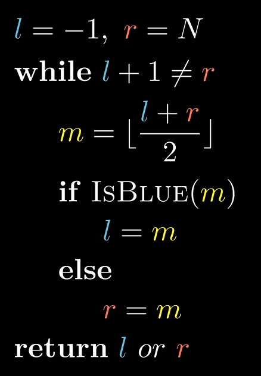

# 算法笔记：二分查找通用模板（红蓝染色法）

## 1. 核心思想

传统二分法常因边界处理（`+1`, `-1`）、循环条件（`<`, `<=`）导致死循环或越界。**红蓝染色法**（又称开区间法 `(l, r)`）通过将解空间划分为"蓝"（可行）和"红"（不可行）两个区域，利用双指针维护边界，完美解决了上述问题。

### 1.1 染色模型

将所有可能的答案区间想象成两种颜色：

- **蓝色 (Blue)**：满足题目条件的值（左侧区域）。

- **红色 (Red)**：不满足题目条件的值（右侧区域）。

- **分界线**：蓝色的右边界与红色的左边界，即我们要求的答案。

  

### 1.2 指针定义

- **l** (Left)：始终指向 **蓝色** 区域的最右侧（当前已知的"最大可行解"）。
- **r** (Right)：始终指向 **红色** 区域的最左侧（当前已知的"最小不可行解"）。
- **区间 (l,r)**：开区间，代表尚未探索的未知区域。

### 1.3 算法流程

1. **初始化**：l和 r必须包裹住所有可能的答案。

2. **循环条件**：`while (l + 1 != r)`。只要 l和 r不相邻，说明中间还有未知元素。

3. **中点计算**：
   $$
   mid=⌊(l+r)/2⌋。
   $$
   
4. **状态转移**： 若 `check(mid)`为 `true`（蓝色）：l=mid（贪心，试图找更大的）。 若 `check(mid)`为 `false`（红色）：r=mid（收缩，答案肯定比它小）。

5. **终止状态**：l和 r相邻。 求最大可行解：返回 l。 求最小不可行解：返回 r。

------

## 2. 模板代码 (C++)



```cpp
// 1. 确定搜索范围 [MIN, MAX]
// l 设为取值范围左边界 - 1 (或者一个合法的最小值)
// r 设为取值范围右边界 + 1
int l = MIN - 1, r = MAX + 1;

while (l + 1 != r) {
    // 2. 计算中点 (防溢出写法: l + (r-l)/2 )
    int mid = (l + r) / 2;
    
    // 3. 染色判断 IsBlue
    if (check(mid)) {
        l = mid; // mid 是蓝色，l 跟进
    } else {
        r = mid; // mid 是红色，r 收缩
    }
}

// 4. 根据题目要求返回 l 或 r
// 找满足条件的最大值 -> return l;
// 找不满足条件的最小值 -> return r;
```

------

## 3. 初始化的边界法则

初始化的核心原则是：**宁可多包，不可漏包**。

| 场景                   | 答案的有效范围 (闭区间) | l的初始值       | r的初始值  |
| ---------------------- | ----------------------- | --------------- | ---------- |
| **数组下标 (0-index)** | [0, N-1]                | -1              | N          |
| **数组下标 (1-index)** | [1, N]                  | 0               | N + 1      |
| **二分答案 (数值)**    | [MinVal, MaxVal]        | MinVal - 1 或 0 | MaxVal + 1 |

> **注意**：l初始值设为 0 在很多"求长度/求数量"的非负整数二分中是安全的，因为长度 0 通常是合法的（或者无意义但不影响逻辑的）。

------

## 4. 实战案例：切木棍 (二分答案)

### 4.1 题目特征

- **输入**：M 根木棍，目标是切出 N 段等长的小段。
- **输出**：小段的**最大长度**。
- **单调性**： 如果长度 L 能切够 N 段，那么长度 < L 一定也能切够（**蓝色**）。 如果长度 L 切不够 N 段，那么长度 > L 一定也切不够（**红色**）。

### 4.2 关键逻辑设计

#### A. 二分对象

不是数组下标，而是 **长度 (Length)**。

- 最小值：0
- 最大值：最长那根木棍的长度 (`max_element`)

#### B. Check 函数 (`IsBlue`)

$$
cnt = \sum_{i=1}^{M} \lfloor \frac{sticks[i]}{Len} \rfloor
$$

判断条件：`cnt >= Target_N`。

判断条件：`cnt ≥ Target_N`。

#### C. 坑点排查

1. **除零错误**：二分过程中 mid可能为 0，在 `check`函数中必须特判 `if (mid == 0) return true;`。
2. **变量混淆**：题目给的 N 和 M 含义要分清（谁是木棍数，谁是目标段数）。
3. **容器大小**：使用 `vector`前必须 `resize`或使用 `push_back`，禁止直接访问未初始化的下标。

### 4.3 修正后的标准代码

```cpp
bool check(int len, int target, const vector<int>& sticks) {
    if (len == 0) return true; // 防止除 0 崩溃
    long long cnt = 0;         // 必须初始化，防止累加垃圾值
    for (int s : sticks) {
        cnt += s / len;
    }
    return cnt >= target;      // 只有切出来的段数足够，才是"蓝色"
}

void solve() {
    // 假设 sticks 已正确输入
    int max_len = *max_element(sticks.begin(), sticks.end());
    
    // 初始化：包裹 [0, max_len]
    int l = 0, r = max_len + 1;
    
    while (l + 1 != r) {
        int mid = (l + r) / 2;
        if (check(mid, target_n, sticks)) {
            l = mid; // 可行，试图找更长的
        } else {
            r = mid; // 不可行，太长了
        }
    }
    cout << l << endl; // 返回最大的可行长度
}
```

------

## 5. 为什么这个模板"一定是对的"？

1. **必然收敛**：因为 mid取的是下整，且循环条件保证 r−l≥2，所以 l<mid<r恒成立。区间长度每次严格减小，不会死循环。
2. **不越界**：l和 r只是守门员。虽然 l初始可能为 -1，但 mid永远落在 (l,r)之间，只要 check 函数不访问 l或 r指向的实际数组（而是访问 mid），就是安全的。
3. **语义清晰**：循环结束后，l就是"蓝色的右边界"，r就是"红色的左边界"。求最大可行解直接取 l，无需纠结 `return l`还是 `return mid`还是 `return l-1`。